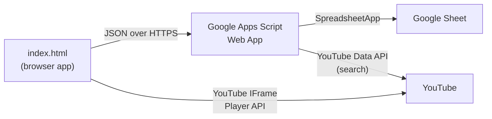

# Radio KRIS

**A browser-based, shared, near-synchronous radio station with a Winamp-inspired UI.**
Everyone tuned in hears (approximately) the same track at the same spot at the same time — like a real radio broadcast. Tracks come from YouTube, and all the shared state lives in a Google Sheet.

🎧 **Live:** [radiokris.org](https://radiokris.org)

---

## What it is

Radio KRIS is a single standalone `index.html` that anyone can open in a browser (desktop or mobile). It plays an always-on station: when you open the app and tune in, you join wherever the broadcast currently is. There's no server to run — a Google Apps Script web app bound to a Google Sheet acts as the tiny backend, and GitHub Pages hosts the front-end.

## Features

- **Always-on, near-synchronous playback** — a shared clock in the Sheet keeps everyone at roughly the same spot; smart drift correction nudges you back in line without constant stutter.
- **Play / pause** — pausing is local; resuming snaps you back to the *live* position (it's a broadcast, not a personal player).
- **Gong!** — anyone can end the current track for everyone and skip to the next, with a confirm, a "gonged by …" announcement, a cooldown, and the classic gong hit.
- **Add / remove tracks** — in-app YouTube search to add; anyone can remove any track (it's communal). In-flight spinners while the queue updates.
- **Switchable channels** — each tab in the Sheet is a station you can tune between, each with its own clock and subtitle.
- **Cohort passwords** — each password lands a friend group on its own default channel (but any valid password can reach every channel).
- **Per-channel chat** — a collapsible chat/status feed, including gong/add/remove events.
- **Upvote / downvote** — Reddit-style per-track voting (one vote per device).
- **Live listener presence**, a scrolling marquee, a faux spectrum visualizer, and a view-only scrubber — all in a beveled, LCD-green Winamp skin.
- **Loops forever** — at the end of the queue it wraps back to track 1.

## How it works

- **Front-end** (`index.html`) — HTML/CSS/JS, no build step. Plays audio via the YouTube IFrame Player API (YouTube Music tracks share video IDs with YouTube).
- **Backend** (`Code.gs`) — one Apps Script deployed as a web app (*execute as me / accessible to anyone*). It's the only thing that touches the Sheet, holds the YouTube Data API key server-side, and validates the shared password. Actions: `login`, `getState`, `getStations`, `createPlaylist`, `setSubtitle`, `setCohort`, `search`, `addTrack`, `removeTrack`, `playTrack`, `gong`, `postChat`, `advance`, `heartbeat`, `vote`.
- **Storage** — a Google Sheet. One tab per channel, plus system tabs: `Metadata` (per-station clock/now-playing), `Presence`, `Cohorts`, `Stations` (subtitles), `Chat`, and `Votes`.

### The sync model

The station's position is **computed, never streamed**. The Sheet stores the current track id and the wall-clock time it started (`trackStartedAt`), using **server time as the single source of truth**. Each client computes `position = serverNow − trackStartedAt`, cancels out its own clock skew, and seeks the player there — tolerating small drift and correcting larger drift, resyncing on track changes and tab refocus. Track advancement is deterministic and client-driven (guarded by a lock), so the station keeps "playing" even when nobody's listening, and a late joiner computes exactly where it should be.

## Repo layout

| File | What it is |
|------|------------|
| `index.html` | The entire front-end app (this is what's served at radiokris.org) |
| `Code.gs` | The Google Apps Script backend — paste into the Sheet's Apps Script |
| `SETUP.md` | Step-by-step deploy guide (API key, deploy, cohorts) |
| `CNAME` | Custom domain for GitHub Pages |

## Setup

Full instructions are in **[SETUP.md](SETUP.md)**. The short version:

1. Enable the **YouTube Data API v3** in a Google Cloud project and make an API key.
2. Paste `Code.gs` into the Sheet's Apps Script and add the key as Script Property `YT_API_KEY`.
3. Deploy the script as a **Web App** (*Execute as: Me · Who has access: Anyone*) and copy the `/exec` URL.
4. Put that URL into `CONFIG.url` in `index.html`.
5. Open `index.html` (or host it) and tune in.

> Playback needs an `https://` origin — opening the file directly (`file://`) makes YouTube refuse to play.

## Channels and cohort passwords

Each tab in the Sheet is a channel. Passwords are **cohort keys**, managed in the `Cohorts` tab (`label` · `passwordHash` · `defaultStation`): a password unlocks the whole app and sets which channel you *land* on — everyone can still switch to any channel. Adding a friend group is one new row (no redeploy). See SETUP.md for the hashing one-liner.

## A note on security

The shared password is **obfuscation, not a lock**. It's stored as a salted hash (the plaintext word appears nowhere), but the hash travels on every request and is replayable, and this repo is public — so treat the password as a "please don't," and keep nothing sensitive in a station. Vote dedup is per-device (clearing storage or a new device = a fresh vote). This is all deliberate: Radio KRIS trades real auth for zero-friction, no-account access.

## Built with

Vanilla HTML/CSS/JS · YouTube IFrame Player + Data APIs · Google Apps Script · Google Sheets · GitHub Pages.

---

The first track on the flagship channel is a ~9-second recording of a 1989 Dodge Omni's transmission grinding itself to shrapnel — the startup sound of the original Radio KRIS. It stays.
